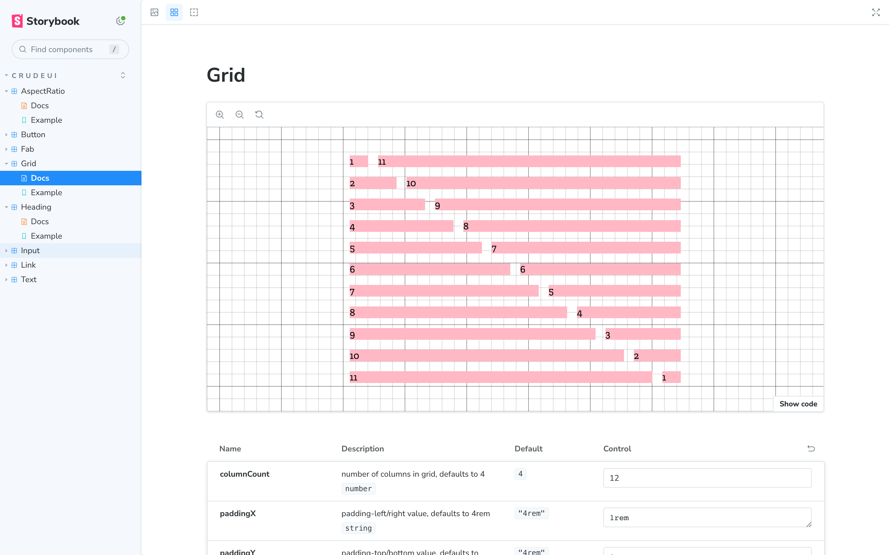

<div align="center">
   
</div>

<h1 align="center">Crude UI</h1>

**Crude UI** is a wip implementation of the Crude Design System by Shaunak Anil Bhanarkar that features foundational components with a neubrutalist aesthetic. It uses styled-components to implement a theme system, grid system, responsive typography, text input with error handling, and other responsive components.

- [Crude Design System - Neubrutalism](https://www.figma.com/community/file/1239679378684173808) design system this UI Kit is based on, by Shaunak Anil Bhanarkar.
- [NPM page](https://www.npmjs.com/package/crude-ui)

## Installation

```bash
npm i crude-ui
```

## Documentation

Wip storbook

## Theming

wip
